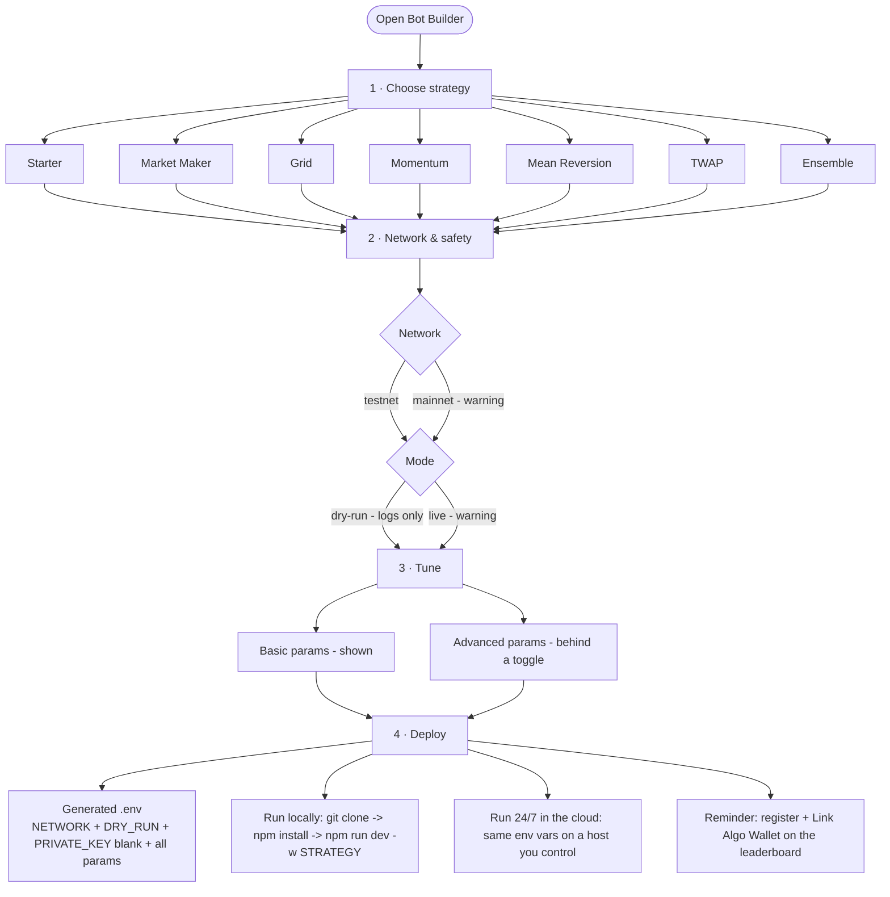
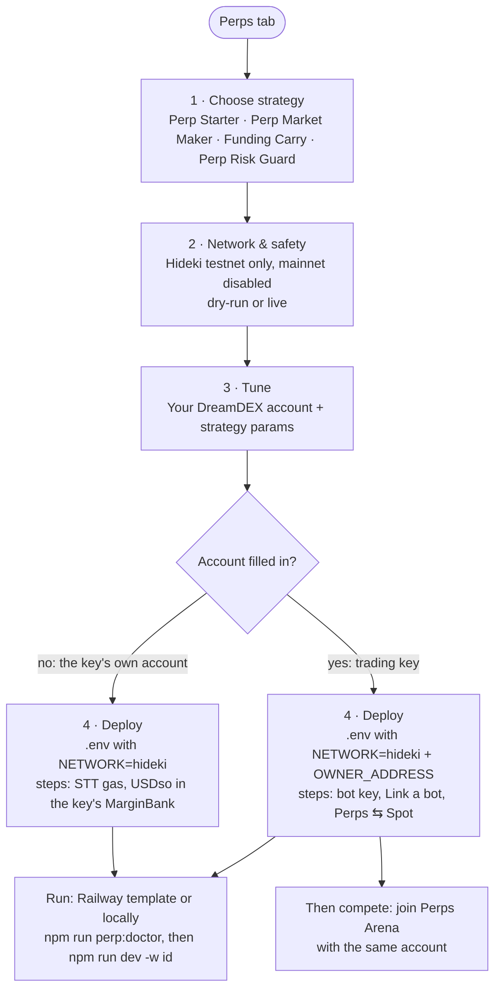

# dreamBot Builder — flow & logic map

How the wizard turns clicks into a runnable bot config. For anyone integrating
this into a page. **There is no backend:** it's a pure front-end that assembles a
`.env` + run command from the user's choices. The private key is never entered
on the site.

## The wizard in one picture



## The four steps

| Step | What the user does | What it sets |
| --- | --- | --- |
| **1 · Strategy** | Picks one of 7 strategies | Chooses the whole parameter set + the `npm run dev -w <id>` target |
| **2 · Network & safety** | testnet/mainnet, dry-run/live | `NETWORK`, `DRY_RUN` (defaults: `testnet`, `true`) |
| **3 · Tune** | Adjusts values (basic always shown, advanced behind a toggle) | Every parameter's value |
| **4 · Deploy** | Copies the config + run steps | The final `.env` and the run command |

**Key rule:** the generated `.env` always contains **every** parameter (basic
**and** advanced), at its default unless the user changed it. "Advanced" only
hides fields in the UI — it does not remove them from the output. Some strategies
also emit fixed `envDefaults` (e.g. Ensemble always writes `FEATURES_AI=false`)
that never appear in Tune.

## Output contract (what the site produces)

Deterministic. For a chosen strategy `X` with params `p = value`:

```
# .env
NETWORK=<testnet|mainnet>
DRY_RUN=<true|false>
PRIVATE_KEY=            # user adds their own, must start with 0x

<X_SYMBOL>=<market>
<...every other param>=<value>
```

Plus the run command, where `<id>` is the strategy id below:

```
git clone https://github.com/somnia-chain/dreamdex-bot-kit
cd dreamdex-bot-kit
npm install
# save the .env above here, then:
npm run dev -w <id>        # dry-run: logs orders, sends nothing
```

Markets offered: `SOMI:USDso`, `WETH:USDso`, `WBTC:USDso`, `USDC.e:USDso`
(`USDC.e:USDso` is mainnet-only).

## Per-strategy reference

Defaults and env-var names match the bot kit's `strategies/*/src/config.ts`
exactly, so the generated `.env` drops straight in.

### Starter · `npm run dev -w starter`
Quotes both sides; one editable function.

| Param (env) | Label | Default | Tier |
| --- | --- | --- | --- |
| `SYMBOL` | Market | `SOMI:USDso` | basic |
| `STARTER_SPREAD_BPS` | Spread (bps) | `10` | basic |
| `STARTER_SIZE_USDSO` | Order size (USDso) | `20` | basic |
| `STARTER_TICK_MS` | Re-check every (ms) | `5000` | advanced |

### Market Maker · `npm run dev -w market-making`
Rest quotes both sides, earn the spread.

| Param (env) | Label | Default | Tier |
| --- | --- | --- | --- |
| `MM_SYMBOL` | Market | `SOMI:USDso` | basic |
| `MM_HALF_SPREAD_BPS` | Half-spread (bps) | `5` | basic |
| `MM_NOTIONAL_USDSO` | Order size (USDso) | `20` | basic |
| `MM_INVENTORY_SKEW_BPS` | Inventory skew (bps) | `4` | basic |
| `MM_REQUOTE_TRIGGER_BPS` | Re-quote when price moves (bps) | `3` | basic |
| `MM_MAX_BOOK_SPREAD_BPS` | Skip if book wider than (bps) | `50` | advanced |
| `MM_TARGET_INVENTORY_USDSO` | Target inventory (USDso) | `0` | advanced |
| `MM_REQUOTE_COOLDOWN_MS` | Min re-quote gap (ms) | `2000` | advanced |
| `MM_REFRESH_INTERVAL_MS` | Poll interval (ms) | `5000` | advanced |

### Grid · `npm run dev -w grid`
A ladder of orders for a ranging market.

| Param (env) | Label | Default | Tier |
| --- | --- | --- | --- |
| `GRID_SYMBOL` | Market | `SOMI:USDso` | basic |
| `GRID_STEP_BPS` | Grid step (bps) | `30` | basic |
| `GRID_LOT_USDSO` | Lot size (USDso) | `15` | basic |
| `GRID_MAX_INVENTORY_USDSO` | Max inventory (USDso) | `90` | basic |
| `GRID_MAX_SESSION_LOSS_USDSO` | Stop after loss (USDso) | `25` | basic |
| `GRID_MAX_SPREAD_BPS` | Skip if book wider than (bps) | `60` | advanced |
| `GRID_STUCK_TIMEOUT_MS` | Stuck-order timeout (ms) | `900000` | advanced |
| `GRID_INTERVAL_MS` | Poll interval (ms) | `8000` | advanced |

### Momentum · `npm run dev -w momentum`
Follow the trend, with take-profit and stop-loss.

| Param (env) | Label | Default | Tier |
| --- | --- | --- | --- |
| `MOM_SYMBOL` | Market | `WETH:USDso` | basic |
| `MOM_NOTIONAL_USDSO` | Position size (USDso) | `25` | basic |
| `MOM_ENTRY_MOMENTUM` | Entry momentum | `0.008` | basic |
| `MOM_TAKE_PROFIT_PCT` | Take profit | `0.01` | basic |
| `MOM_STOP_LOSS_PCT` | Stop loss | `0.006` | basic |
| `MOM_WINDOW_SIZE` | Lookback window | `20` | advanced |
| `MOM_EXIT_MOMENTUM` | Exit momentum | `0` | advanced |
| `MOM_CROSS_BPS` | Cross-through (bps) | `8` | advanced |
| `MOM_INTERVAL_MS` | Poll interval (ms) | `5000` | advanced |

### Mean Reversion · `npm run dev -w mean-reversion`
Bet the price snaps back to average (RSI + Bollinger).

| Param (env) | Label | Default | Tier |
| --- | --- | --- | --- |
| `MR_SYMBOL` | Market | `WETH:USDso` | basic |
| `MR_NOTIONAL_USDSO` | Position size (USDso) | `25` | basic |
| `MR_RSI_OVERSOLD` | RSI oversold (buy) | `30` | basic |
| `MR_TAKE_PROFIT_PCT` | Take profit | `0.012` | basic |
| `MR_STOP_LOSS_PCT` | Stop loss | `0.02` | basic |
| `MR_RSI_PERIOD` | RSI period | `14` | advanced |
| `MR_RSI_EXIT` | RSI exit | `52` | advanced |
| `MR_WINDOW_SIZE` | Lookback window | `40` | advanced |
| `MR_BB_PERIOD` | Bollinger period | `20` | advanced |
| `MR_BB_MULT` | Bollinger multiplier | `2` | advanced |
| `MR_CROSS_BPS` | Cross-through (bps) | `8` | advanced |
| `MR_INTERVAL_MS` | Poll interval (ms) | `5000` | advanced |

### TWAP · `npm run dev -w twap`
Split one big order into slices over time.

| Param (env) | Label | Default | Tier |
| --- | --- | --- | --- |
| `TWAP_SYMBOL` | Market | `SOMI:USDso` | basic |
| `TWAP_SIDE` | Side (`buy` / `sell`) | `buy` | basic |
| `TWAP_TOTAL_USDSO` | Total to trade (USDso) | `20` | basic |
| `TWAP_SLICES` | Number of slices | `5` | basic |
| `TWAP_INTERVAL_SEC` | Seconds between slices | `30` | basic |
| `TWAP_MAX_SLIPPAGE_BPS` | Max slippage (bps) | `15` | advanced |

### Ensemble · `npm run dev -w ensemble`
Three advisors vote on each trade (momentum, mean reversion, grid). Vote-only: the builder always emits `FEATURES_AI=false` (not shown in Tune). Optional LLM / `OPENAI_*` stay kit-repo-only.

| Param (env) | Label | Default | Tier |
| --- | --- | --- | --- |
| `SYMBOL` | Market | `WETH:USDso` | basic |
| `MSA_NOTIONAL_USDSO` | Position size (USDso) | `25` | basic |
| `MSA_TAKE_PROFIT_PCT` | Take profit | `0.012` | basic |
| `MSA_STOP_LOSS_PCT` | Stop loss | `0.01` | basic |
| `MSA_MAX_RISK_PERCENT` | Max risk per trade | `0.15` | basic |
| `MSA_MAX_LOSS_PERCENT` | Halt after loss | `0.5` | basic |
| `FEATURES_MOMENTUM` | Momentum advisor | `true` | basic |
| `FEATURES_MEAN_REVERSION` | Mean reversion advisor | `true` | basic |
| `FEATURES_GRID` | Grid advisor | `true` | basic |
| `FEATURES_AI` | *(fixed in `.env`)* | `false` | not shown |
| `MSA_LOOP_MS` | Cycle interval (ms) | `60000` | advanced |
| `MSA_CROSS_BPS` | Cross-through (bps) | `8` | advanced |
| `MSA_WINDOW_SIZE` | Lookback window | `40` | advanced |
| `MSA_MOM_ENTRY` | Momentum entry | `0.008` | advanced |
| `MSA_MOM_STRONG` | Strong momentum | `0.01` | advanced |
| `MSA_RSI_PERIOD` | RSI period | `14` | advanced |
| `MSA_BB_PERIOD` | Bollinger period | `20` | advanced |
| `MSA_BB_MULT` | Bollinger multiplier | `2` | advanced |
| `MSA_RSI_OVERSOLD` | RSI oversold | `30` | advanced |
| `MSA_RSI_OVERBOUGHT` | RSI overbought | `70` | advanced |

## Perps (Hideki testnet)

The third market type, next to Spot and Event contracts. Four strategies, from
the kit's `perp-*` workspaces ([dreamdex-bot-kit#50](https://github.com/somnia-chain/dreamdex-bot-kit/pull/50),
merging on Monday 12 Oct, before the Perps Arena announcement). Until that merge,
the clone and Railway links in this prototype point at a kit `main` that has no
`perp-*` yet.

Testnet only: perps run on **Hideki** (chain 50383), the network
[app.testnet.dreamdex.io](https://app.testnet.dreamdex.io) and Perps Arena trade on.



### What is different from spot

| | Spot / EC | Perps |
| --- | --- | --- |
| `NETWORK` | `testnet` or `mainnet` | always `hideki`. The kit reads `testnet` as Shannon and refuses `mainnet` |
| Whose account trades | the key's own wallet | `OWNER_ADDRESS`, the user's DreamDEX account. `PRIVATE_KEY` is a separate bot key linked to it |
| Funding | tokens in the key's wallet | USDso in the account's Perps balance, moved with Perps ⇆ Spot |
| Gas | the key's own | the bot key pays its own STT |
| Leverage | n/a | the account's setting in the app. A linked bot reads it and cannot change it |
| Take-profit / stop-loss (perp-starter) | n/a | watched by the bot while it runs. A linked bot cannot arm stop orders for the account |

### The trading-key flow (recommended)

1. The user fills **Your DreamDEX account** (`OWNER_ADDRESS`). Inside the app
   this can be prefilled from the connected account.
2. Deploy shows three steps before the run commands:
   1. Make a new key just for the bot (for example `cast wallet new`) and put it
      on the `PRIVATE_KEY` line. Not the account's own key.
   2. In the app: wallet > **Link a bot**. Paste the bot's address, keep
      **Perps** ticked, press **Add bot**. The bot pays its gas in STT; that
      screen can offer to send it some.
   3. On the perps page: **Perps ⇆ Spot**, move USDso from **Spot wallet** to
      **Perps account**. A linked bot only trades margin that is already there.
3. `npm run perp:doctor` checks the link, the bot's gas and the account's
   margin in one read, and sends nothing.

The bot can place, cancel and reduce orders for the account, every fill lands
on the account, and it cannot withdraw. At startup each strategy checks the
link; when live, an unlinked key exits with a message that says to use Link a
bot.

An `OWNER_ADDRESS` that is not `0x` plus 40 hex characters blocks Next, because
the kit refuses it at startup. Blank is allowed: the bot then trades its own
key's perps account, which needs USDso in its own MarginBank and STT for gas,
and perp-starter arms real stop orders (each locks 0.15 STT until it fires or is
cancelled).

### Output contract (perps)

Blank values are left out of the file, so a blank `OWNER_ADDRESS` or a blank
guard `PERP_SYMBOL` simply does not appear.

```
NETWORK=hideki
DRY_RUN=<true|false>
STRATEGY=<perp-starter|perp-maker|perp-funding|perp-guard>
PRIVATE_KEY=0x...

OWNER_ADDRESS=<the user's DreamDEX account>
PERP_SYMBOL=<market>
<...every other param>=<value>
```

Run, locally:

```
git clone https://github.com/somnia-chain/dreamdex-bot-kit
cd dreamdex-bot-kit
npm install
# save the .env above here, then:
npm run perp:doctor
npm run dev -w <id>
```

On Railway: the same template as the other strategies. `STRATEGY` picks the
workspace, the four `perp-*` ids are on the start script's allow-list, and a
`perp-*` service with no `NETWORK` of its own runs on Hideki. The builder writes
`NETWORK=hideki` anyway.

Markets offered (app names, the same 15 that are live on Hideki): `BTC-PERP`,
`ETH-PERP`, `SOL-PERP`, `HYPE-PERP`, `XRP-PERP`, `BNB-PERP`, `DOGE-PERP`,
`ADA-PERP`, `SUI-PERP`, `LINK-PERP`, `AVAX-PERP`, `XLM-PERP`, `NEAR-PERP`,
`WLD-PERP`, `TAO-PERP`.

### Units (they are not uniform, so every help line names one)

| Fields | Unit |
| --- | --- |
| `*_NOTIONAL_USDSO`, `*_MAX_POSITION_USDSO` | position value in USDso, not margin. At 2x, 50 needs about 25 |
| `PERP_TAKE_PROFIT_PCT`, `PERP_STOP_LOSS_PCT`, `PERP_GUARD_REDUCE_PCT` | percent: `2` is 2% |
| `PERP_FUNDING_MIN_APR`, `PERP_FUNDING_EXIT_APR` | a yearly fraction: `0.1` is 10% |
| `PERP_GUARD_REDUCE_BELOW`, `PERP_GUARD_FLATTEN_BELOW` | a multiple of maintenance margin: `1.0` is where liquidation starts |
| `*_BPS` | basis points |

### Checks the Tune step mirrors from the kit

| Strategy | Condition | Builder |
| --- | --- | --- |
| all four | `OWNER_ADDRESS` set but not an address | blocks Next |
| Funding Carry | exit APR above entry APR | blocks Next (the kit refuses to start) |
| Perp Risk Guard | flatten level above reduce level | blocks Next (the kit refuses to start) |
| Perp Risk Guard | flatten level at or below 1.0 | warning |
| Perp Starter | take-profit or stop-loss at or below 0 | warning |
| Perp Market Maker | half-spread at or below 0 | warning |

### Perp Starter · `npm run dev -w perp-starter`
One leveraged position, closed at a take-profit or a stop-loss.

| Param (env) | Label | Default | Tier |
| --- | --- | --- | --- |
| `OWNER_ADDRESS` | Your DreamDEX account | blank | basic |
| `PERP_SYMBOL` | Market | `BTC-PERP` | basic |
| `PERP_SIDE` | Side (`long` / `short`) | `long` | basic |
| `PERP_NOTIONAL_USDSO` | Position size (USDso) | `50` | basic |
| `PERP_LEVERAGE` | Leverage | `2` | basic |
| `PERP_TAKE_PROFIT_PCT` | Take profit (%) | `2` | basic |
| `PERP_STOP_LOSS_PCT` | Stop loss (%) | `1` | basic |
| `PERP_TICK_MS` | Check position every (ms) | `10000` | advanced |
| `PERP_FLATTEN_ON_EXIT` | Close position on stop | `false` | advanced |

### Perp Market Maker · `npm run dev -w perp-maker`
A bid and an ask around the mark, leaned back to flat.

| Param (env) | Label | Default | Tier |
| --- | --- | --- | --- |
| `OWNER_ADDRESS` | Your DreamDEX account | blank | basic |
| `PERP_SYMBOL` | Market | `BTC-PERP` | basic |
| `PERP_MM_HALF_SPREAD_BPS` | Half-spread (bps) | `15` | basic |
| `PERP_MM_NOTIONAL_USDSO` | Quote size (USDso) | `25` | basic |
| `PERP_MM_MAX_POSITION_USDSO` | Max position (USDso) | `100` | basic |
| `PERP_MM_INVENTORY_SKEW_BPS` | Inventory skew (bps) | `10` | basic |
| `PERP_MM_REQUOTE_TRIGGER_BPS` | Re-quote when mark moves (bps) | `8` | basic |
| `PERP_MM_LEVERAGE` | Leverage | `2` | advanced |
| `PERP_MM_REFRESH_MS` | Poll interval (ms) | `15000` | advanced |

### Funding Carry · `npm run dev -w perp-funding`
Holds whichever side funding pays, and steps aside when it stops paying.

| Param (env) | Label | Default | Tier |
| --- | --- | --- | --- |
| `OWNER_ADDRESS` | Your DreamDEX account | blank | basic |
| `PERP_SYMBOL` | Market | `BTC-PERP` | basic |
| `PERP_FUNDING_MIN_APR` | Enter above (APR) | `0.1` | basic |
| `PERP_FUNDING_EXIT_APR` | Exit below (APR) | `0.03` | basic |
| `PERP_FUNDING_NOTIONAL_USDSO` | Position size (USDso) | `50` | basic |
| `PERP_FUNDING_MAX_POSITION_USDSO` | Max position (USDso) | `200` | basic |
| `PERP_FUNDING_LEVERAGE` | Leverage | `2` | advanced |
| `PERP_FUNDING_POLL_MS` | Check funding every (ms) | `60000` | advanced |

### Perp Risk Guard · `npm run dev -w perp-guard`
Not a trader: reduces a position before liquidation reaches it.

| Param (env) | Label | Default | Tier |
| --- | --- | --- | --- |
| `OWNER_ADDRESS` | Your DreamDEX account | blank | basic |
| `PERP_SYMBOL` | Market | blank (every market held) | basic |
| `PERP_GUARD_REDUCE_BELOW` | Start reducing below | `1.5` | basic |
| `PERP_GUARD_REDUCE_PCT` | Reduce by (%) | `25` | basic |
| `PERP_GUARD_FLATTEN_BELOW` | Close everything below | `1.15` | basic |
| `PERP_GUARD_POLL_MS` | Check health every (ms) | `30000` | advanced |

### Example: Perp Starter, trading key, dry-run, ETH-PERP

```
NETWORK=hideki
DRY_RUN=true
STRATEGY=perp-starter
PRIVATE_KEY=0x...

OWNER_ADDRESS=0x...
PERP_SYMBOL=ETH-PERP
PERP_SIDE=long
PERP_NOTIONAL_USDSO=50
PERP_LEVERAGE=2
PERP_TAKE_PROFIT_PCT=2
PERP_STOP_LOSS_PCT=1
PERP_TICK_MS=10000
PERP_FLATTEN_ON_EXIT=false
```

→ run with `npm run dev -w perp-starter`.

Tested live on Hideki through a linked key on 7 and 8 Oct: all four strategies,
covering open, reduce, close and cancel. Every order was sent by the bot key
(`placeOrderFor` / `cancelOrderFor`) and settled on the account.

## Example: full input → output

**Input:** Market Maker · testnet · dry-run · defaults →

```
NETWORK=testnet
DRY_RUN=true
PRIVATE_KEY=

MM_SYMBOL=SOMI:USDso
MM_HALF_SPREAD_BPS=5
MM_NOTIONAL_USDSO=20
MM_INVENTORY_SKEW_BPS=4
MM_REQUOTE_TRIGGER_BPS=3
MM_MAX_BOOK_SPREAD_BPS=50
MM_TARGET_INVENTORY_USDSO=0
MM_REQUOTE_COOLDOWN_MS=2000
MM_REFRESH_INTERVAL_MS=5000
```

→ run with `npm run dev -w market-making`.

## Source of truth

The whole map is driven by one data file: [`src/strategies.ts`](src/strategies.ts).
Add or change a strategy/param there and the wizard and this map both follow.
